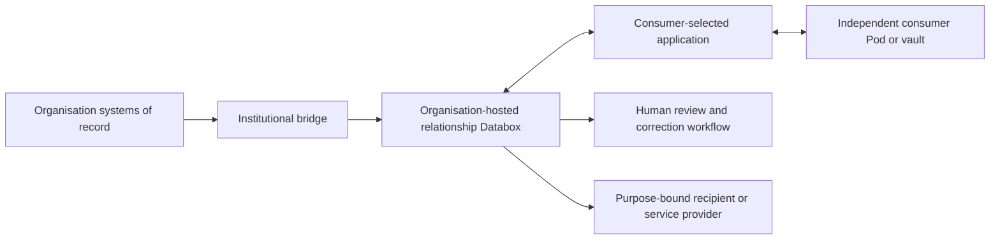

# CSS – Databox

[](LICENSE.md)
[](package.json)
[](https://solidproject.org/)

CSS – Databox is an organisation-focused Linked Data exchange platform built by refactoring and extending
[Community Solid Server](https://github.com/CommunitySolidServer/CommunitySolidServer) (CSS) 7.1.9.

It gives an organisation a governed, relationship-specific Solid data space for providing information to a person
and receiving deliberate, purpose-bound information from that person. The person connects through an independent
Solid Pod, vault, wallet or compatible personal knowledge environment of their choice.

CSS – Databox is not an official upstream Community Solid Server distribution. It retains the modular CSS runtime,
Solid HTTP surface and Components.js composition while adding the Databox identity, policy, evidence, exchange and
organisation-tailoring layers in this repository.

## The model

A Databox is technically a Solid Pod, but it represents the organisation's governed view of one relationship. It is
not presented as the consumer's general-purpose Pod and does not give the organisation access to the consumer's
independent storage.



The organisation can provide records, credentials, notices, receipts, menus, vouchers and service information. The
consumer can explicitly return corrections, claims, preferences, evidence, orders or selected personal facts. Each
accepted exchange produces auditable state and, where applicable, a signed receipt that can be retained outside the
organisation's system.

## What it does

### Relationship-specific Solid data spaces

- Provisions opaque, program-scoped Databox URLs without customer identifiers in paths.
- Creates separate security boundaries for each organisation program and consumer relationship.
- Uses the normal CSS Solid HTTP, LDP, Solid-OIDC and WAC processing path.
- Supports connection credentials that are holder-bound, program-specific, revocable and rotatable.
- Prevents a Databox connection from becoming authority to browse the consumer's independent Pod.

### Two-way governed data exchange

- Transforms organisation source events into signed institutional records.
- Commits exact accepted bytes before issuing an acceptance receipt.
- Accepts deliberate consumer submissions without granting the organisation general Pod-reading rights.
- Preserves append-only evidence, supersession links, correction history and disposition state.
- Supports notifications, recovery feeds, idempotency and reconciliation boundaries.

### Policy, assurance and evidence

- Applies record-class, purpose, legal-basis and authentication-assurance checks.
- Carries versioned ODRL permissions, prohibitions and duties with exchanged records.
- Records signed receipts, evidence-chain events and visible duty outcomes.
- Provides governed review and signed disposition workflows for corrections and contested records.
- Fails closed when required identity, tenant, policy, proof or evidence inputs cannot be verified.

### Mapping Forge and organisation tailoring

- Registers and validates versioned institution profiles.
- Maps protected source-system customer references to opaque Databox relationships.
- Defines a backplane for industry packs, organisation manifests, program blueprints and immutable releases.
- Separates private Databox data from optional public-presence tooling such as website Schema.org/JSON-LD and
  business-listing reconciliation.
- Provides planning and synthetic fixtures for welfare coordination, restaurants, loyalty programs, donations,
  budgeting, resource pools and inter-organisational claims.

### Compliance decision support

The compliance workstream maps pinned legislation and human-rights sources to technical controls, evidence and
consumer-facing information obligations. It is decision support: it does not self-certify that an organisation or
deployment is legally compliant. Applicability, exceptions and publication claims remain subject to qualified human
review.

## Demonstrator journeys

### Seraphim and Charles James

The welfare demonstrator models Seraphim, a synthetic homelessness registration and coordination service, and
Charles James, a synthetic participant using an independent Flutter-based Solid application. The planned journey
includes:

- correction of a false and potentially defamatory organisational assertion with file or URI evidence;
- residency, concession, disability-support, health-needs and voucher credentials;
- goals, stages, dependencies, diary entries, events and completed or outstanding tasks;
- consent-scoped referrals and coordinated communications with service providers;
- privacy-shielded donations and aggregate donor reporting;
- consumer budgeting, receipt evidence and organisation/service economic reporting; and
- pairwise voucher redemption and claims between participating Databox organisations.

All people, credentials, organisations, entitlements, keys and transactions used by the demonstrator are synthetic.
Imported provider-directory rows remain unverified until reviewed.

### Restaurant menu and ordering

The restaurant journey demonstrates an organisation publishing a menu into a consumer's selected Solid environment.
The consumer creates an order locally and shares only the selected order and relevant dietary information back to
the organisation. The acknowledgement, status events and receipt can then be retained by the consumer.

## Live CSS integration

The experimental live preset mounts the Mapping Forge inside the CSS Components.js composition. Provisioned Databox
resources are stored in CSS and retrieved through the ordinary Solid authorization route.

Build the project:

```shell
npm install
npm run build
```

Start the memory-backed live demonstration with a control token containing at least 32 bytes:

```powershell
$token = [Convert]::ToHexString([Security.Cryptography.RandomNumberGenerator]::GetBytes(32))
npm.cmd run start:databox-live -- --databoxControlToken $token --baseUrl http://localhost:3000/ --port 3000
```

The protected demonstration control plane is mounted at `/.databox/forge`:

| Method | Route | Purpose |
|---|---|---|
| `GET` | `/.databox/forge/programs` | List registered program summaries |
| `POST` | `/.databox/forge/programs` | Register a validated institution profile |
| `POST` | `/.databox/forge/mappings` | Provision a relationship and issue its connection credential |
| `POST` | `/.databox/forge/source-events` | Transform and commit an institutional event and issue its receipt |

See the [live CSS integration guide](databox/live-css-integration.md) for operation, verification and current
limitations.

## Repository guide

| Location | Contents |
|---|---|
| [`src/databox/`](src/databox/) | Databox identity, provisioning, policy, bridge, evidence, review and Forge code |
| [`config/databox/`](config/databox/) | Experimental live Components.js configuration |
| [`databox/`](databox/) | Architecture, decisions, threat model, vocabulary, fixtures and implementation plans |
| [`databox/forge-plan/`](databox/forge-plan/) | Product backplane, application and demonstrator plans |
| [`test/unit/databox/`](test/unit/databox/) | Databox unit and security-invariant tests |
| [`test/integration/DataboxLive.test.ts`](test/integration/DataboxLive.test.ts) | Live CSS/OIDC/WAC integration test |

Start with the [Databox documentation index](databox/README.md), then read the
[reference architecture](databox/dbx-04-reference-architecture.md),
[decision register](databox/decisions/README.md), [threat model](databox/dbx-03-threat-model.md) and
[Forge productization plan](databox/forge-plan/README.md).

## Security and privacy principles

1. A Databox belongs to one declared organisation program and one represented relationship.
2. URLs, logs and storage paths must not contain directly identifying customer information.
3. Knowing a resource URL never grants access.
4. Organisation credentials cannot authorize browsing of a consumer's independent Pod.
5. Consumer submissions are explicit disclosures, not background reads from personal storage.
6. Accepted institutional records are not silently overwritten; changes remain linked and auditable.
7. Record sensitivity is evaluated against current verified assurance, purpose and policy.
8. Hosting-provider administration is treated as a security boundary, not implicitly trusted access.
9. Public-presence tools must remain isolated from customer mappings and private Databox records.
10. Legal or interoperability claims require named review and executable evidence; the software does not
    self-certify them.

## Implementation status

DBX-01 through DBX-24 of the reference implementation plan are complete. The instrumental DBX-25 live CSS slice is
also implemented: it provisions private WAC-protected resources, commits accepted bytes into CSS before receipt
issuance, denies anonymous retrieval and permits authenticated holder retrieval with a DPoP-bound CSS identity.

The broader DBX-25 two-program lifecycle suite remains active. DBX-26 adversarial assurance, DBX-27 independent
Solid interoperability assessment and DBX-28 release readiness are not yet complete.

This remains a reference and demonstrator implementation. Current production gaps include durable Forge registries,
KMS-managed keys, durable outbox/feed/idempotency storage, a WORM or equivalently protected evidence substrate,
production organisation IAM, independent security review, legal-policy review and external interoperability evidence.

## Relationship to Community Solid Server

The repository began with Community Solid Server and continues to use substantial upstream CSS code and architecture.
Keeping that lineage visible matters technically and legally: CSS provides the modular HTTP server, Solid protocol
handling, identity integration, storage layers and Components.js runtime on which the Databox implementation builds.

Upstream CSS documentation remains useful for its underlying server and configuration model:

- [Community Solid Server repository](https://github.com/CommunitySolidServer/CommunitySolidServer)
- [Community Solid Server documentation](https://communitysolidserver.github.io/CommunitySolidServer/)
- [Solid specifications](https://solidproject.org/TR/)

The existing package name and Components.js identifiers are retained for CSS compatibility while the derivative is
being refactored. They should not be interpreted as an assertion that this Databox branch is an official upstream CSS
release.

## Copyright, attribution and license

The original Community Solid Server code retains its copyright attribution to Inrupt Inc. and imec.

The Databox-specific design, implementation, documentation, vocabularies, fixtures and refactoring are attributed to:

### Timothy Charles Holborn

[LinkedIn](https://www.linkedin.com/in/ubiquitous/) · [timothy.holborn@gmail.com](mailto:timothy.holborn@gmail.com)

The repository is distributed under the [MIT License](LICENSE.md). The license file preserves the original CSS
copyright notice and separately records the Databox copyright holder. Third-party dependencies, standards,
legislation and imported datasets retain their own copyright, licensing and legal status.

## Contact

For Databox design and implementation enquiries, contact Timothy Charles Holborn through
[LinkedIn](https://www.linkedin.com/in/ubiquitous/) or
[timothy.holborn@gmail.com](mailto:timothy.holborn@gmail.com).
